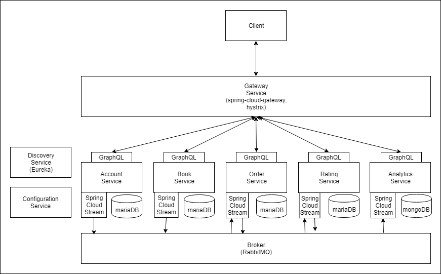

# project-reithmeier


## Disclaimer 

This is a student project for the University of Applied Sciences Upper Austria.


## Description
Microservices for Books, Users, Orders, Rating, Analytics. Users and Books can be administered. 
User order and rate books. Orders and ratings can be analysed. 

## Architecture


The client communicates with the respective services synchronously via an API gateway. 
The services themselves communicate asynchronously with events via spring cloud stream and a rabbitMQ broker.
An eureka discovery service is used for service discovery. 
A configuration service is used to store the configurations in one repository 
and to be able to provide different configuration profiles for each service (e.g. develop, staging).


## Goals
Clients should be able to:
* add users and addresses for users
* view users and addresses
* add, view and delete books
* add, view and cancel orders for books from users
* add, view and delete ratings for books from users
* view orders by rating, average order user, orders per day

## Solution

### Discovery Service
A Eureka discovery service is implemented.

```xml
<dependency>
    <groupId>org.springframework.cloud</groupId>
    <artifactId>spring-cloud-starter-netflix-eureka-server</artifactId>
</dependency>
```

```java
@EnableEurekaServer
@SpringBootApplication
public class DiscoveryServiceApplication {

    public static void main(String[] args) {
        SpringApplication.run(DiscoveryServiceApplication.class, args);
    }

}
```

```properties
server.port=8761

eureka.client.register-with-eureka=false
eureka.client.fetch-registry=false
```

Each client must have an `@EnableDiscoveryClient` Annotation, an `spring.application.name` property
and the following dependency:
```xml
<dependency>
    <groupId>org.springframework.cloud</groupId>
    <artifactId>spring-cloud-starter-netflix-eureka-client</artifactId>
</dependency>
```


### Configuration Service

Since all the files should be contained in this git repository 
the configuration service was configured to look for properties files on the classpath.
Therefore it has to be started with the native spring boot profile.
Alternatively a separate VCS repository can be used.
The properties must have the name _<SERVICE-NAME>-<PROFILE>.properties_ (e.g. _sve.project.bookservice-develop.properties_)
to be distributed when services request properties for profiles.
The configuration service is also a discovery client, so other services can find it.
Therefore the discovery service cannot use the configuration service.


```xml
<dependency>
    <groupId>org.springframework.cloud</groupId>
    <artifactId>spring-cloud-config-server</artifactId>
</dependency>
```

```java
@EnableDiscoveryClient
@EnableConfigServer
@SpringBootApplication
public class ConfigurationServerApplication {

    public static void main(String[] args) {
        SpringApplication.run(ConfigurationServerApplication.class, args);
    }

}
```

```properties
server.port=8888
#spring.cloud.config.server.git.uri=https://some-git.com
spring.cloud.config.server.native.search-locations=classpath:/config/
```

Services can use the following properties to request configurations
```properties
spring.cloud.config.profile=develop
spring.cloud.config.uri=SVE.PROJECT.CONFIGURATIONSERVICE
spring.cloud.config.allow-override=true
spring.cloud.config.override-none=true
```
They also need the following dependency
```xml
<dependency>
    <groupId>org.springframework.cloud</groupId>
    <artifactId>spring-cloud-starter-config</artifactId>
</dependency>
```

### Gateway service
An API gateway is used to centralise all incoming graphql requests.
Also Hystrix is used to map error status codes to 503 (See Problems/GraphQL and Hystrix).

```xml
<dependency>
    <groupId>org.springframework.cloud</groupId>
    <artifactId>spring-cloud-starter-gateway</artifactId>
</dependency>
<dependency>
    <groupId>org.springframework.cloud</groupId>
    <artifactId>spring-cloud-starter-netflix-hystrix</artifactId>
</dependency>
<dependency>
    <groupId>org.springframework.boot</groupId>
    <artifactId>spring-boot-starter-data-redis</artifactId>
</dependency>
```

```java
@EnableHystrix
@EnableDiscoveryClient
@SpringBootApplication
public class GatewayServiceApplication {

    public static void main(String[] args) {
        SpringApplication.run(GatewayServiceApplication.class, args);
    }

    @Bean
    public RouteLocator customRouteLocator(RouteLocatorBuilder builder) {
        return builder.routes()
                //account
                .route("account-graphql", r -> r
                        .path("/account/graphql")
                        .filters(f -> f
                                .rewritePath("^/account", "")
                                .hystrix(c -> c
                                        .setName("fallbackCmd")
                                        .setFallbackUri("forward:/hystrixfallback")))
                        .uri("lb://SVE.PROJECT.ACCOUNTSERVICE/graphql"))
                //[...]
                .build();
    }
}
```

```properties
#gateway
spring.cloud.gateway.discovery.locator.enabled=true
spring.cloud.gateway.discovery.locator.lowerCaseServiceId=true
```

### Spring Cloud Stream
Spring cloud stream is used for event based asynchronous messaging between services.
A RabbitMQ broker is used to handle the messaging.

A service must therefore have the following properties to connect to the rabbitMQ broker.
```properties
spring.rabbitmq.host=localhost
spring.rabbitmq.port=5672
spring.rabbitmq.username=guest
spring.rabbitmq.password=guest
```

To send or receive messages with spring cloud stream, a service must declare bindings for a channel, 
where destination maps to the rabbitMQ exchange and group maps to one or more queues.

```properties
spring.cloud.stream.bindings.bookChannel.destination=book
spring.cloud.stream.bindings.bookChannel.group=bookOrderQueue, bookRatingQueue
spring.cloud.stream.bindings.bookChannel.content-type=application/json
```

To send messages an interface has been defined to use custom or multiple channels.
This interface can be injected containing a message channel that provides a send method;
```java
public interface EventSource {
    @Output("userChannel")
    MessageChannel userEvent();
    
    //[...] other channels
}

@EnableBinding(EventSource.class)
public class Sender {

    private final EventSource eventSource;

    public Sender(EventSource eventSource) {
        this.eventSource = eventSource;
    }

    public UserEvent sendCreateUser(User user) {
        UserEvent userEvent = new UserEvent(user, UserEvent.Action.CREATE);
        eventSource.userEvent().send(MessageBuilder.withPayload(userEvent).build());
        return userEvent;
    }
    
    //[...] other events
}
```

To receive messages a similar interface can be defined.

```java
public interface EventSink {
    @Input("bookChannel")
    SubscribableChannel bookEvent();

    @Input("userChannel")
    SubscribableChannel userEvent();
}

@EnableBinding(EventSink.class)
public class Receiver {

    private final BookService bookService;
    private final UserService userService;

    public Receiver(BookService bookService, UserService userService) {
        this.bookService = bookService;
        this.userService = userService;
    }

    @StreamListener(value = "bookChannel")
    public void receiveBook(BookEvent event) {
        Book book = event.toBook();
        bookService.saveBook(book);
    }
    
    //[...] other channels
}
```

### GraphQL
GraphQL is used to provide a way to access and manipulate data from the outside.
Each service must therefore provide a graphQL schema containing types, queries and mutations.


```graphql
type Address{
    id:ID!
    country:String
    zip:String
    town:String
    street:String
    house:String
}

type User{
    id:ID!
    name: String
    firstName: String
    lastName: String
    addresses: [Address]
}

type Query{
    allUsers: [User]
    allAddresses: [Address]
    user(id:ID!): User
    address(id:ID!): Address
    hystrixDebug:Boolean
}

input AddressInput{
    country:String
    zip:String
    town:String
    street:String
    house:String
}

type Mutation{
    addUser(name: String, firstName: String, lastName:String) : User
    addAddressToUser(userId:ID, address:AddressInput): Address
}
```

```xml
<dependency>
    <groupId>com.graphql-java</groupId>
    <artifactId>graphql-spring-boot-starter</artifactId>
    <version>5.0.2</version>
</dependency>
<dependency>
    <groupId>com.graphql-java</groupId>
    <artifactId>graphiql-spring-boot-starter</artifactId>
    <version>5.0.2</version>
</dependency>
<dependency>
    <groupId>com.graphql-java</groupId>
    <artifactId>graphql-java-tools</artifactId>
    <version>5.0.0</version>
</dependency>
```

Resolvers must be implemented according to the schema.

```java
@Component
public class Mutation implements GraphQLMutationResolver {

    //[...]

    public User addUser(String name, String firstName, String lastName){
        return userService.saveUser(name, firstName, lastName);
    }

    public Address addAddressToUser(Long userId, AddressInput address){
        return addressService.addAddressToUser(userId, new Address(address));
    }
}
```


To map Exceptions to GraphQL Errors, these exceptions must implement the GraphQLError interface.
The stacktrace is ignored to hide server specific information from clients.

```java
public class NotFoundException extends RuntimeException implements GraphQLError {
    public NotFoundException(String message) {
        super(message);
    }
    public NotFoundException(Long id, String type) {
        super(type + " with ID:'" + id.toString() + "' not found.");
    }

    @Override
    public List<SourceLocation> getLocations() {
        return null;
    }

    @Override
    public ErrorType getErrorType() {
        return ErrorType.ValidationError;
    }

    @JsonIgnore
    @Override
    public StackTraceElement[] getStackTrace() {
        return super.getStackTrace();
    }
}
```

### Account-, Book-, Ordering-, Rating-Service
Account service handles user information (user, address). 
Book service handles book information (book, publisher, author).
Ordering service handles orders of books by users (orderEntry, book, user).
Rating service handles ratings of books by users (rating, book, user).
These services are of course barebone and incomplete for business appliance (especially account and ordering). 
They can however be easily extended and are meant to show the architecture and the interaction of the services.
They each are very similar in structure, therefore they are summarized here.
Each of these services is a discovery client and a configuration client.
They also declare streaming channels. 
Where account service and book service only have outgoing channels,
whereas ordering service and rating service also have incoming channels.
They all use hibernate and jpa to access their separate maria database 
and have a graphQL interface to access this data.

```properties
#data base
spring.datasource.url=jdbc:mysql://localhost:3308/accounts_db
spring.datasource.username=user
spring.datasource.password=pw

#Hibernate Configuration
hibernate.dialect=org.hibernate.dialect.H2Dialect
hibernate.hbm2ddl.auto=update
hibernate.ejb.naming_strategy=org.hibernate.cfg.ImprovedNamingStrategy
hibernate.show_sql=false
hibernate.format_sql=true
hibernate.enable_lazy_load_no_trans=true
``` 

### Analytics Service
This service is very similar to books-, ordering-, account- and rating-service.
It however uses spring scheduling to calculate analytics results in a fixed interval
and to save them to the database.
This is necessary, because such calculations can require a large amount of time.
Also a mongo database is used to store data.
```java
    @Scheduled(fixedRateString = "${analytics.update.rate}")
    public void calculateAnalytics(){
        AnalyticsResult result = new AnalyticsResult();

        result.setAvgOrderPerUser(analyticsService.avgOrderPerUser());
        result.setOrdersByRatings(analyticsService.orderByRating());
        result.setOrdersPerDays(analyticsService.ordersPerDay());
        result.setTimestamp(dateFormat.format(new Date()));
        analyticsResultService.saveAnalyticsResult(result);

        log.info("result calculated");
        log.info(result.toString());
    }
```


## Problems

### GraphQL and Hystrix

GraphQL maps each exception that is thrown in the service to an graphQL error. This error is contained in the graphQL response message.
If an exception occurs on the service when a specific query or mutation is requested 
a Response with 200 OK status and error messages in the body is returned.
I have found no way to configure hystrix on the API Gateway to check if the body contains an error message or to change the status of the response.
Therefore each exception thrown on the service that does not implement GraphQLError is mapped to a "internal server error" - error message
and a 200 OK status. Exceptions that implement GraphQLError are mapped to their specific message and also a 200 OK status.
For this reason hystrix does not work with GraphQL.

To show this I implemented a hystrixDebug graphql-query, that throws a `RuntimeException`, in the account service.
* Request: `GET localhost:8080/account/graphql?query={hystrixDebug}`
* Response: `200 OK`
```json
{
    "data": {
        "hystrixDebug": null
    },
    "errors": [
        {
            "message": "Internal Server Error(s) while executing query",
            "path": null,
            "extensions": null
        }
    ]
}
```

To show that hystrix usually works i have also implemented a TestController with binding `/test/hystrix` on the gateway service.
This one also throws a `RuntimeException`.
The gateway maps `/hystrix` to `/test/hystrix`. The fallback returns a 503 Service Unavailable.
* Request: `GET localhost:8080/hystrix`
* Response: `503 Service Unavailable`
`
service unavailable (fallback)
`

## Test

### account service

`GET http://localhost:8080/account/graphql?query={allUsers{id}}`

`200 OK`
```json
{
    "data": {
        "allUsers": [
            {
                "id": "1"
            },
            {
                "id": "2"
            },
            {
                "id": "6"
            },
            {
                "id": "7"
            },
            {
                "id": "11"
            },
            {
                "id": "12"
            },
            {
                "id": "16"
            },
            {
                "id": "17"
            },
            {
                "id": "18"
            },
            {
                "id": "19"
            },
            {
                "id": "20"
            },
            {
                "id": "21"
            },
            {
                "id": "22"
            },
            {
                "id": "23"
            },
            {
                "id": "24"
            },
            {
                "id": "25"
            },
            {
                "id": "26"
            }
        ]
    }
}
```

`GET http://localhost:8080/account/graphql?query={allAddresses{id}}`
```json
{
    "data": {
        "allAddresses": [
            {
                "id": "3"
            },
            {
                "id": "4"
            },
            {
                "id": "5"
            },
            {
                "id": "8"
            },
            {
                "id": "9"
            },
            {
                "id": "10"
            },
            {
                "id": "13"
            },
            {
                "id": "14"
            },
            {
                "id": "15"
            }
        ]
    }
}
```

*user does not exist:*

`GET http://localhost:8080/account/graphql?query={user(id:4){id, name, firstName, lastName}}`
```json
{
    "data": {
        "user": null
    },
    "errors": [
        {
            "message": "Exception while fetching data (/user) : User with ID:'4' not found.",
            "path": [
                "user"
            ],
            "exception": {
                "cause": null,
                "locations": null,
                "errorType": "ValidationError",
                "message": "User with ID:'4' not found.",
                "path": null,
                "extensions": null,
                "localizedMessage": "User with ID:'4' not found.",
                "suppressed": []
            },
            "locations": [
                {
                    "line": 1,
                    "column": 2
                }
            ],
            "extensions": null,
            "errorType": "DataFetchingException"
        }
    ]
}
```

`GET http://localhost:8080/account/graphql?query={user(id:2){id, name, firstName, lastName}}`
```json
{
    "data": {
        "user": {
            "id": "2",
            "name": "userName2",
            "firstName": "Karl",
            "lastName": "Karlsberger"
        }
    }
}
```

`GET http://localhost:8080/account/graphql?query={address(id:3){id, country, zip, town, street, house}}`
```json
{
    "data": {
        "address": {
            "id": "3",
            "country": "austria",
            "zip": "4664",
            "town": "Steyermühl",
            "street": "Hauptstraße",
            "house": "1"
        }
    }
}
```

`POST http://localhost:8080/account/graphql/`
```graphql
mutation {
  addUser(name:"Hans123", firsName:"Hans", lastName:"Hansson"){
      id
  }
}
```

```json
{
    "data": {
        "addUser": {
            "id": "27"
        }
    }
}
```

Rating service:
```log
received: User[id=27, name='Hans123', deleted=false]
```

Ordering service:
```log
received: User[id=27, name='Hans123', deleted=false]
```

`POST http://localhost:8080/account/graphql/`
```graphql
mutation {
  addAddressToUser(userId:27, address:{country:"austria", zip:"4232", town:"Hagenberg", street:"softwarepark", house:"1"}){
      id
  }
}
```

```json
{
    "data": {
        "addAddressToUser": {
            "id": "28"
        }
    }
}
```

### analytics service

`GET localhost:8080/analytics/graphql?query={orderByRating{rating, orders}}`
```json
{
    "data": {
        "orderByRating": [
            {
                "rating": 1,
                "orders": 9
            },
            {
                "rating": 3,
                "orders": 9
            },
            {
                "rating": 0,
                "orders": 0
            }
        ]
    }
}
```

`GET localhost:8080/analytics/graphql?query={avgOrderPerUser}`
```json
{
    "data": {
        "avgOrderPerUser": 6
    }
}
```

`GET localhost:8080/analytics/graphql?query={ordersPerDay{orders, day}}`
```json
{
    "data": {
        "ordersPerDay": [
            {
                "orders": 1,
                "day": "2019-04-03"
            },
            {
                "orders": 1,
                "day": "2019-04-04"
            },
            {
                "orders": 14,
                "day": "2019-05-04"
            }
        ]
    }
}
```

### book service

`GET localhost:8080/book/graphql?query={allBooks{id}}`
```json
{
    "data": {
        "allBooks": [
            {
                "id": "5"
            },
            {
                "id": "6"
            },
            {
                "id": "7"
            },
            {
                "id": "8"
            },
            {
                "id": "9"
            },
            {
                "id": "10"
            },
            {
                "id": "11"
            },
            {
                "id": "12"
            }
        ]
    }
}
```

`GET localhost:8080/book/graphql?query={book(id:6){name, author{firstName, lastName}, publisher{name}}}`
```json
{
    "data": {
        "book": {
            "name": "n2",
            "author": {
                "firstName": "Fritz",
                "lastName": "Fritzberger"
            },
            "publisher": {
                "name": "Springer Verlag"
            }
        }
    }
}
```

*publisher does not exist*

`POST http://localhost:8080/book/graphql/`
```graphql
mutation {
  saveBook(name:"Spring Framework for dummies", authorId:1, publisherId:2){id}
}
```
```json
{
    "data": {
        "saveBook": null
    },
    "errors": [
        {
            "message": "Exception while fetching data (/saveBook) : Publisher with ID:'2' not found.",
            "path": [
                "saveBook"
            ],
            "exception": {
                "cause": null,
                "locations": null,
                "errorType": "ValidationError",
                "message": "Publisher with ID:'2' not found.",
                "path": null,
                "extensions": null,
                "localizedMessage": "Publisher with ID:'2' not found.",
                "suppressed": []
            },
            "locations": [
                {
                    "line": 2,
                    "column": 3
                }
            ],
            "extensions": null,
            "errorType": "DataFetchingException"
        }
    ]
}
```

`POST http://localhost:8080/book/graphql/`
```graphql
mutation {
  saveBook(name:"Spring Framework for dummies", authorId:2, publisherId:3){id}
}
```
```json
{
    "data": {
        "saveBook": {
            "id": "13"
        }
    }
}
```

Rating Serivce
```log
received: Book[id=13, name='Spring Framework for dummies', deleted=false]
```
Ordering Service
```log
received: Book[id=13, name='Spring Framework for dummies', deleted=false]
```

`POST http://localhost:8080/book/graphql/`
```graphql
mutation {
  deleteBook(id:13){id}
}
```

```json
{
    "data": {
        "deleteBook": {
            "id": "13"
        }
    }
}
```

Rating Serivce
```log
received: Book[id=13, name='Spring Framework for dummies', deleted=true]
```
Ordering Service
```log
received: Book[id=13, name='Spring Framework for dummies', deleted=true]
```

### ordering service

`GET localhost:8080/order/graphql?query={allOrders{id}}`
```json
{
    "data": {
        "allOrders": [
            {
                "id": "1"
            },
            {
                "id": "2"
            },
            {
                "id": "3"
            },
            {
                "id": "4"
            },
            {
                "id": "5"
            },
            {
                "id": "6"
            },
            {
                "id": "7"
            },
            {
                "id": "8"
            },
            {
                "id": "9"
            },
            {
                "id": "10"
            },
            {
                "id": "11"
            },
            {
                "id": "12"
            },
            {
                "id": "13"
            },
            {
                "id": "14"
            },
            {
                "id": "15"
            },
            {
                "id": "16"
            },
            {
                "id": "17"
            }
        ]
    }
}
```

`GET localhost:8080/order/graphql?query={orderEntry(id:1){book{id}, user{id}, date}}`
```json
{
    "data": {
        "orderEntry": {
            "book": {
                "id": "5"
            },
            "user": {
                "id": "11"
            },
            "date": "2019-04-03"
        }
    }
}
```

*book does not exist*

`POST http://localhost:8080/order/graphql/`
```graphql
mutation {
  addOrder(date:"2019-06-26", userId:1, bookId:1){id}
}
```
```json
{
    "data": {
        "addOrder": null
    },
    "errors": [
        {
            "message": "Exception while fetching data (/addOrder) : Book with ID:'1' not found.",
            "path": [
                "addOrder"
            ],
            "exception": {
                "cause": null,
                "locations": null,
                "errorType": "ValidationError",
                "message": "Book with ID:'1' not found.",
                "path": null,
                "extensions": null,
                "localizedMessage": "Book with ID:'1' not found.",
                "suppressed": []
            },
            "locations": [
                {
                    "line": 2,
                    "column": 3
                }
            ],
            "extensions": null,
            "errorType": "DataFetchingException"
        }
    ]
}
```

`POST http://localhost:8080/order/graphql/`
```graphql
mutation {
  addOrder(date:"2019-06-26", userId:11, bookId:5){id}
}
```
```json
{
    "data": {
        "addOrder": {
            "id": "18"
        }
    }
}
```

Analytics service:
```log
received: OrderEvent[id=18, book=5, user=11, date='2019-06-26', action=CREATE]
```

`POST http://localhost:8080/order/graphql/`
```graphql
mutation {
  cancleOrder(id:18){id}
}
```
```json
{
    "data": {
        "cancleOrder": {
            "id": "18"
        }
    }
}
```

Analytics service:
```log
received: OrderEvent[id=18, book=5, user=11, date='2019-06-26', action=DELETE]
```

### Rating Service

`GET localhost:8080/rating/graphql?query={allRatings{id}}`

```json
{
    "data": {
        "allRatings": [
            {
                "id": "1"
            },
            {
                "id": "2"
            },
            {
                "id": "3"
            },
            {
                "id": "4"
            },
            {
                "id": "5"
            },
            {
                "id": "6"
            },
            {
                "id": "7"
            },
            {
                "id": "8"
            },
            {
                "id": "9"
            },
            {
                "id": "10"
            },
            {
                "id": "11"
            },
            {
                "id": "12"
            }
        ]
    }
}
```

`GET localhost:8080/rating/graphql?query={rating(id:1){id, book{name}, user{name}}}`

```json
{
    "data": {
        "rating": {
            "id": "1",
            "book": {
                "name": "n3"
            },
            "user": {
                "name": "userName1"
            }
        }
    }
}
```

*book does not exist*

`POST http://localhost:8080/rating/graphql/`
```graphql
mutation {
  addRating(value:2, userId:1, bookId:1){id}
}
```
```json
{
    "data": {
        "addRating": null
    },
    "errors": [
        {
            "message": "Exception while fetching data (/addRating) : Book with ID:'1' not found.",
            "path": [
                "addRating"
            ],
            "exception": {
                "cause": null,
                "locations": null,
                "errorType": "ValidationError",
                "message": "Book with ID:'1' not found.",
                "path": null,
                "extensions": null,
                "localizedMessage": "Book with ID:'1' not found.",
                "suppressed": []
            },
            "locations": [
                {
                    "line": 2,
                    "column": 3
                }
            ],
            "extensions": null,
            "errorType": "DataFetchingException"
        }
    ]
}
```

`POST http://localhost:8080/rating/graphql/`
```graphql
mutation {
  addRating(value:2, userId:11, bookId:5){id}
}
```
```json
{
    "data": {
        "addRating": {
            "id": "13"
        }
    }
}
```

Analytics service:
```log
received: RatingEvent[book=5, user=11, value=2, action=CREATE]
```

`POST http://localhost:8080/rating/graphql/`
```graphql
mutation {
  removeRating(id:13){id}
}
```
```json
{
    "data": {
        "removeRating": {
            "id": "13"
        }
    }
}
```

Analytics service:
```log
received: RatingEvent[book=5, user=11, value=2, action=DELETE]
```


### Configuration Service

*on startup of client on client*
```log
2019-06-26 18:02:32.873  INFO 8028 --- [           main] c.c.c.ConfigServicePropertySourceLocator : Fetching config from server at : http://localhost:8888
2019-06-26 18:02:34.572  INFO 8028 --- [           main] c.c.c.ConfigServicePropertySourceLocator : Located environment: name=sve.project.analyticsservice, profiles=[develop], label=null, version=null, state=null
2019-06-26 18:02:34.572  INFO 8028 --- [           main] b.c.PropertySourceBootstrapConfiguration : Located property source: CompositePropertySource {name='configService', propertySources=[MapPropertySource {name='classpath:/config/sve.project.analyticsservice-develop.properties'}]}
```

### Gateway Service

*service turned off*

`GET localhost:8080/analytics/graphql?query={orderByRating{rating, orders}}`

`503 Service Unavailable`
```text
service unavailable (fallback)
```
